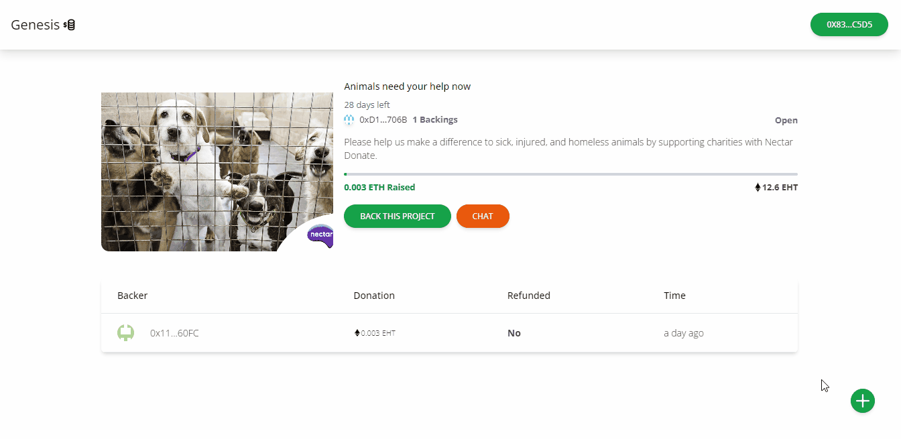

# Web3 Crowd-Funding Platform 

## Introduction

(https://genesis-45443.web.app/)

The Web3 Crowd-Funding Platform is a decentralized application (DApp) that allows users to create and fund projects using blockchain technology. By leveraging the power of smart contracts and decentralized finance (DeFi), this platform ensures transparency, security, and immutability in crowdfunding campaigns.

## Features

- **Decentralized**: Operates on a blockchain, removing the need for intermediaries.
- **Smart Contracts**: Automates the process of funding and ensures funds are only released when predefined conditions are met.
- **Transparency**: All transactions and campaign details are publicly available on the blockchain.
- **Security**: Funds are securely stored in smart contracts and only accessible under specific conditions.
- **Immutable Records**: Once recorded, transactions cannot be altered, ensuring the integrity of the data.

## Technology Stack

- **Frontend**: React.js, Web3.js
- **Backend**: Node.js, Express.js
- **Blockchain**: Ethereum, Solidity
- **Database**: IPFS (InterPlanetary File System) for decentralized storage
- **Smart Contracts**: Solidity


## Usage

### Creating a Campaign

1. Connect your wallet (e.g., MetaMask) to the platform.
2. Navigate to the "Create Campaign" page.
3. Fill in the details of your campaign (title, description, goal amount, deadline).
4. Submit the form to create your campaign. A transaction will be sent to the blockchain to record the campaign details.

### Funding a Campaign

1. Browse through the list of active campaigns.
2. Select a campaign to view its details.
3. Enter the amount you wish to contribute and submit the form.
4. Confirm the transaction in your wallet. The funds will be transferred to the campaign's smart contract.

### Withdrawing Funds

1. Once the campaign reaches its goal and the deadline has passed, the campaign creator can withdraw the funds.
2. Navigate to the "My Campaigns" page and select the campaign.
3. Click the "Withdraw Funds" button and confirm the transaction in your wallet. The funds will be transferred to the creator's address.

## Smart Contracts

The platform uses a set of smart contracts to manage campaigns and contributions.

### CampaignFactory.sol

This contract is responsible for creating and managing individual campaigns.

### Campaign.sol

This contract represents a single campaign. It handles contributions, goal tracking, and fund withdrawal.

## Testing

1. **Run the tests**
   ```bash
   truffle test
   ```

2. The test suite includes unit tests for smart contracts and integration tests for the DApp.


<center><figcaption>Genesis Project</figcaption></center>


<center><figcaption>Back Project</figcaption></center>

## Technology

This demo uses:

- Metamask
- Hardhat
- Infuria
- ReactJs
- Tailwind CSS
- CometChat
- Solidity
- EthersJs
- Faucet

## Running the demo

To run the demo follow these steps:

1. Clone the project with the code below.
    ```sh

    # Make sure you have the above prerequisites installed already!
    git clone
    cd PROJECT_NAME # Navigate to the new folder.
    yarn install # Installs all the dependencies.
    ```
2. Create an Infuria project, copy and paste your key in the spaces below.
3. Update the `.env` file with the following details.
    ```sh
    ENDPOINT_URL=<RPC_URL>
    SECRET_KEY=<SECRET_PHRASE>
    DEPLOYER_KEY=<YOUR_PRIVATE_KEY>
    ```
2. Create a CometChat project, copy and paste your key in the spaces below.
3. Run the app using `yarn start`
<br/>


- **Must use web3 technology in some way** (blockchains, decentralized compute/storage, NFTs, tokens, etc.)
    - Our project leverages web3 technology by integrating Metamask for blockchain interactions, using Solidity for smart contracts, and utilizing decentralized storage solutions.
- **Must be regenerative**: [What is ReFi?](https://blog.toucan.earth/what-is-refi-regenerative-finance/)
    - This project aims to promote regenerative finance by enabling transparent and decentralized funding for eco-friendly and sustainable projects.
- **Project should aim to drive adoption of web3-based approaches to governance and access in land-based projects**
    - The platform facilitates the creation and governance of land-based DAOs, providing tools for decentralized decision-making and resource allocation.
- **Project should aim to drive Ecological Benefits**
    - By supporting projects focused on environmental sustainability, the platform helps drive ecological benefits through community-backed initiatives.
